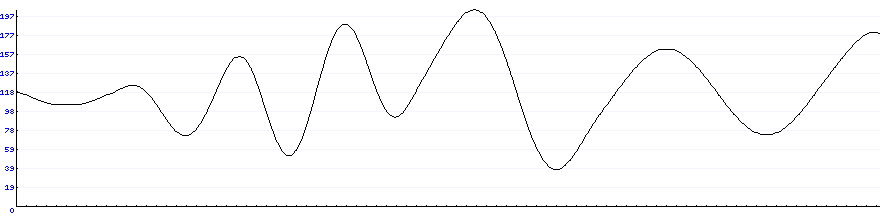

# XLoad

## Overview

XLoad is an application to stress a system. 

This application will run a specified plugin X amount of times in a given timeframe, but randomizing the load at any given time using a noise generation algorithm to simulate a somewhat natural load. 

XLoad will also scale itself with more Threads/Tasks as needed to keep up with the demand of executing a plugin.

## Configuration

To configure plugins, a .json file is needed - check the examples folder.

System configurations can come from multiple sources with different priorities (Higher priority to lower priority):
    
1. Command Line
2. Environment Variables
3. Configuration File

If a variable exists in two of the sources, the higher priority will override the lower priority.

## Variables

### General

| Command Line | Environment Variable | Configuration File                     | Value Type | Description                                                                   |
|--------------|----------------------|----------------------------------------|------------|-------------------------------------------------------------------------------|
| -config      | XLOAD_CONFIG         | -                                      | string     | Path to the json configuration file 
| -scale       | XLOAD_SCALE          | XLoad.Noise.Scale                      | float      | Scale for the Simplex Noise generation                                        |
| -seed        | XLOAD_SEED           | XLoad.Noise.Seed                       | int        | Seed for the noise generation                                                 |
| -resolution  | XLOAD_RESOLUTION     | XLoad.Noise.Resolution                 | int        | Frequency (in seconds) for which a new point is generated                     |
| -time        | XLOAD_TIME           | XLoad.Load.Time                        | int        | Amount of seconds for the system to run                                       |
| -requests    | XLOAD_REQUESTS       | XLoad.Load.Requests                    | int        | Number of requests to be performed in -time/XLOAD_TIME/XLoad.Load.Time        |
| -infinite    | XLOAD_INFINITE       | XLoad.Load.Infinite                    | bool       | If this argument is used, the system will continue to operate after the -time |
| -maxTasks    | XLOAD_MAXTASKS       | XLoad.System.MaxTasks                  | int        | Maximum amount of TPL tasks the system will generate                          |
| -minTasks    | XLOAD_MINTASKS       | XLoad.System.MinTasks                  | int        | Minimum amount of TPL tasks the system will generate                          |
| -dryrun      | XLOAD_DRYRUN         | XLoad.System.DryRun                    | bool       | If true, do not automatically start the load system                           |
| -nostats     | XLOAD_NOSTATS        | XLoad.System.NoStats                   | bool       | If false, do not log statistics to console		                            |
| -            | -                    | XLoad.System.Plugins                   | array      | Array of objects describing the plugins to be loaded and their configurations |
| -image       | XLOAD_IMAGE          | XLoad.Diagnostic.Image                 | string     | Path for the creation of a bmp file with the generated graph                  |
| -            | -                    | {Config Var in XLoad.System.Plugins}   | object     | The configurations to be passed to the plugin                                 |

### XLoad.System.Plugin

This variable indicates the system which plugins to load and which part of the configuration is going to be sent to the plugin.

```json
"Plugins": [
  {
     "Name": "{Plugin name}",
     "Config": "{Configuration root for the plugin}"
  }
]
```

To configure the plugin itself, you use the Plugins[i].Config value to indicate what is the new root for the plugin configuration, as such:

```json
{
    "XLoad": {
        "System": {
            "Plugins": [
              {
                 "Name": "XLoad.Http",
                 "Config": "HttpConfiguration"
              } 
           ]
        }
    },
    "HttpConfiguration": {
       "config1": 1,
       "config2": 2,
       "config3": 3
    }
}
```

## Diagnostic Image

To better inspect the load that XLoad will generate, you can generate a sample image that shows the progress for the first 2 hours of the program running.




## Future work

- Better sample image generation
- Improve configuration pass to plugin
- Improve observability (+plugin) (+file)
- Change to MIT license (change Noise Generation -> Value Noise)

